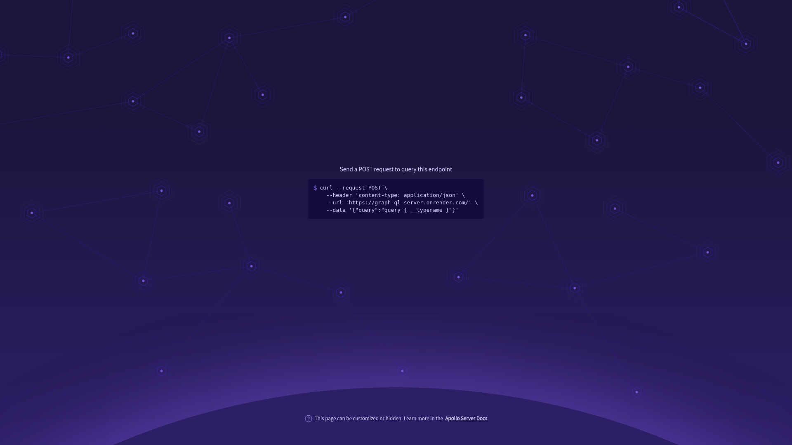

    updated on: 04th December 2024, Wednesday

<div align=center>
    <a href="https://github.com/warmachine028/graph-ql-server">
        
    </a>
    <p style="font-family: roboto, calibri; font-size:12pt; font-style:italic"> A repository to learn GraphQL with REST api </p>
    <a src="https://github.com/warmachine028/graph-ql-server/forks">
        
    </a>
</div>

# [Graph QL Server](https://github.com/warmachine028/graph-ql-server)

![line]

## Table of Contents

- [Introduction](#introduction)
- [Developement](#developement)
- [Tech Stack Used](#tech-stack-used)
- [Preview](#preview)
- [Best Contributors](#best-contributors)
- [License](#license)

![line]

## Introduction

- A basic Graph-QL REST Server
  
![line]

## Developement

```sh
$> cd server
$> npm i         # install packages
$> npm run dev   # start server

> graph-ql-server@1.0.0 dev
> nodemon

[nodemon] 3.1.4
[nodemon] to restart at any time, enter `rs`
[nodemon] watching path(s): src\**\*
[nodemon] watching extensions: js,ts
[nodemon] starting `tsx src/index.ts`
🚀 Server ready at: http://localhost:3000/

...
```

![line]

## Tech Stack Used

- GitHub
- GraphQL
- Github Actions
- Dependabot
- ApolloGraphQL
- NodeJS
- TypeScript
- Nodemon

        

![line]

## Preview



![line]

## Best Contributors

<div align="center">
    <a href="https://github.com/warmachine028/graph-ql-server/graphs/contributors">
        
    </a>
</div>

![line]

## License

- See [LICENSE]

**© Pritam, 2024**

![line]

## Thank you, everyone 💚

[markdown badges]: https://github.com/Ileriayo/markdown-badges
[line]: https://user-images.githubusercontent.com/75939390/137615281-3a875960-92cc-407f-97fe-fd2319bdb252.png
[License]: https://github.com/warmachine028/graph-ql-server/blob/main/LICENSE

<!-- 04/12/24 -->
